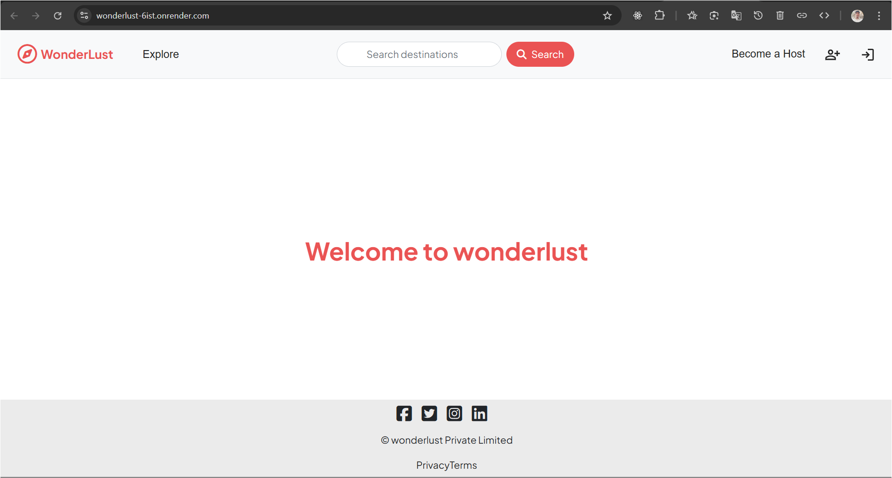
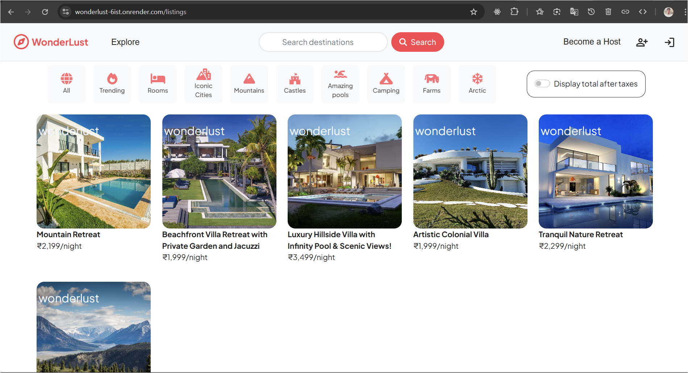
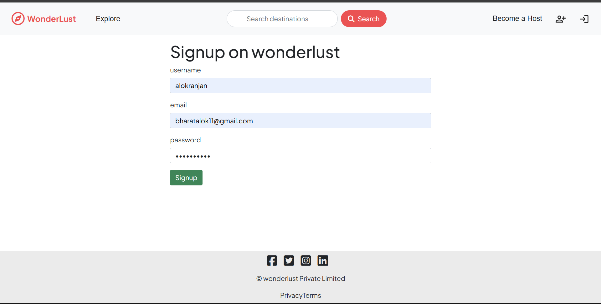
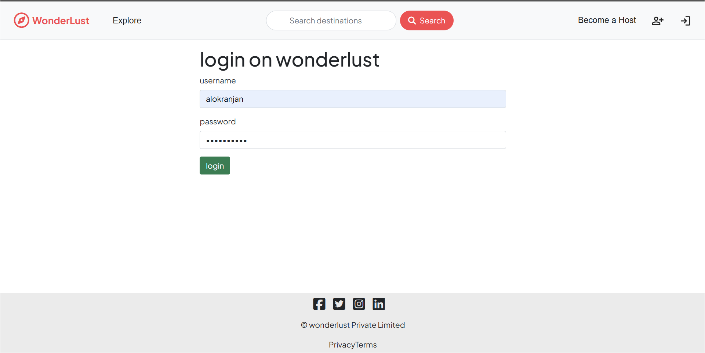
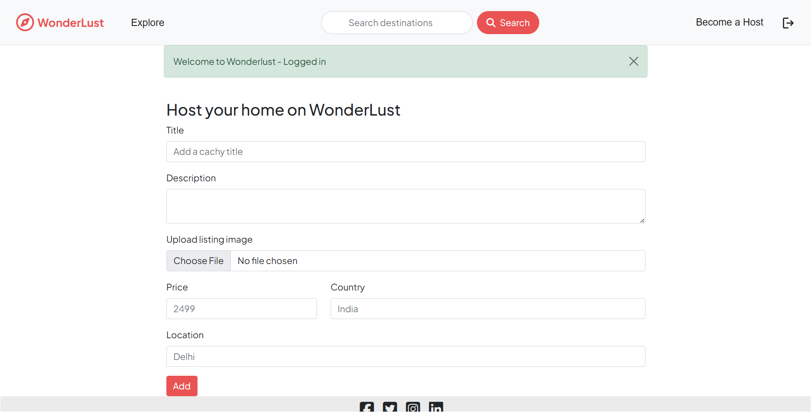
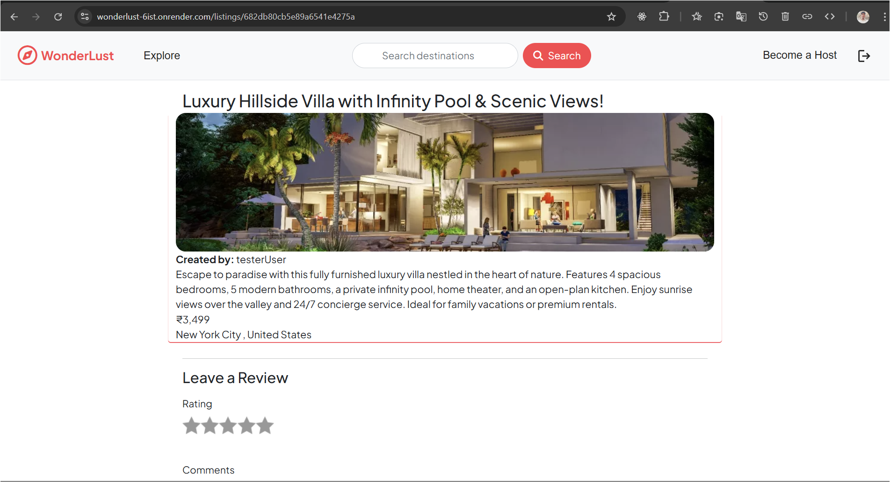
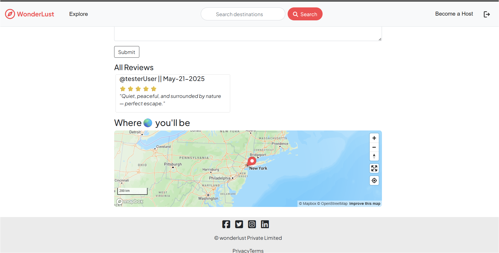
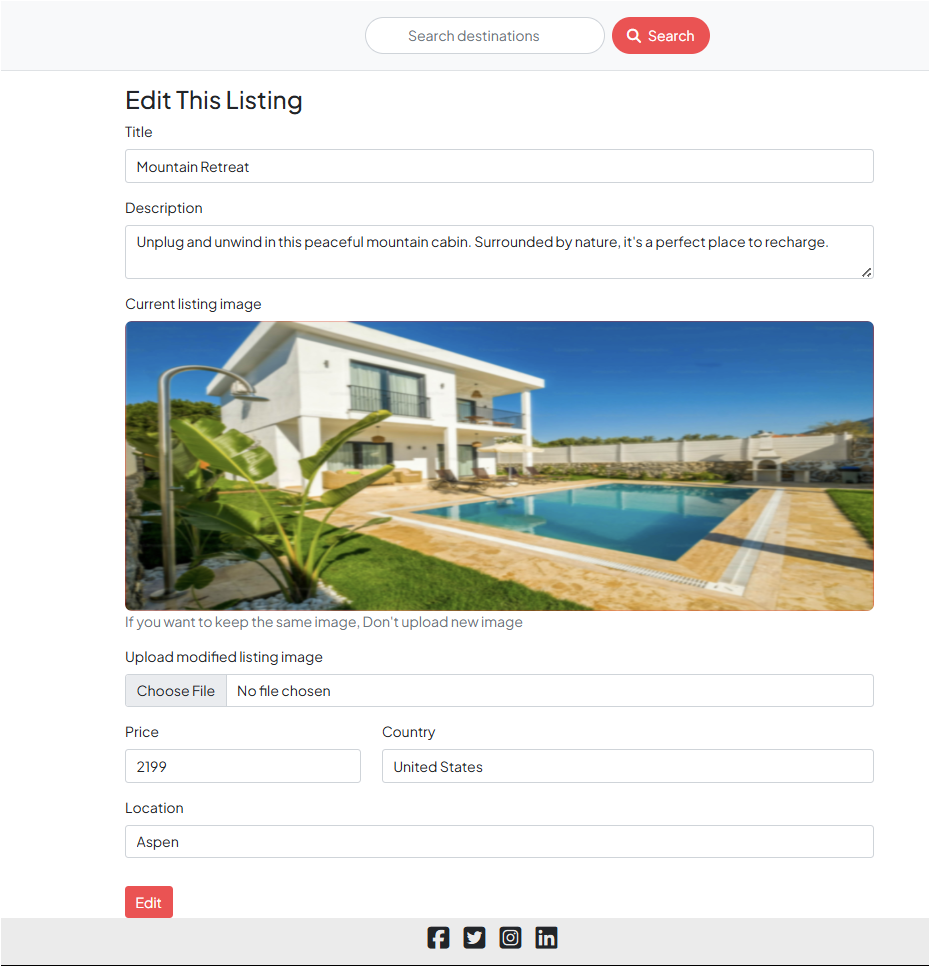

# WonderLust

A full-stack travel and property hosting platform where users can list, discover, and book unique places to stay. Built with Node.js, Express, MongoDB, EJS, and Cloudinary.

## 🌐 Live Demo
[View WonderLust on Render.com](https://wonderlust-6ist.onrender.com)

## 🚀 Description
Wonderlust allows users to sign up, log in, create property listings, upload images, leave reviews, and explore locations with interactive maps.

## ✨ Features
- User authentication (signup, login, logout)
- Create, edit, and delete property listings
- Image uploads with Cloudinary
- Reviews and ratings
- Interactive maps with Mapbox
- Flash messages for user feedback
- Responsive UI with Bootstrap

## 🛠️ Tech Stack
- Node.js, Express.js
- MongoDB & Mongoose
- EJS & ejs-mate
- Passport.js (authentication)
- Cloudinary (image hosting)
- Mapbox (maps & geocoding)
- Bootstrap 5

## 🏁 Getting Started
1. **Clone the repo:**
   ```bash
   git clone https://github.com/bharatalok11/wonderlust.git
   cd wonderlust
   ```
2. **Install dependencies:**
   ```bash
   npm install
   ```
3. **Set up environment variables:**
   Create a `.env` file with the following:
   ```env
   ATLASDB_URL=your_mongodb_connection_string
   SESSION_SECRET=your_session_secret
   CLOUD_NAME=your_cloudinary_cloud_name
   CLOUD_API_KEY=your_cloudinary_api_key
   CLOUD_API_SECRET=your_cloudinary_api_secret
   MAPBOX_TOKEN=your_mapbox_token
   NODE_ENV=development
   PORT=valid_port_number (default is 10000)
   ```
4. **Run the app:**
   ```bash
   node app.js
   ```
   The app will run on `http://localhost:10000` by default.

## 🌍 Deployment
- Ready for deployment on [Render.com](https://render.com/)
- Set all environment variables in the Render dashboard
- Ensure Node version is set to `22.13.1`

## 📁 Folder Structure
```
WebDevelopment/Projects/wonderlust/
│
├── assets/                # Images for README and documentation
├── controllers/           # Route controllers
├── models/                # Mongoose models
├── public/                # Static files (CSS, JS, images)
├── routes/                # Express routes
├── utils/                 # Utility functions and classes
├── views/                 # EJS templates
├── app.js                 # Main application file
├── package.json           # Project metadata and scripts
└── README.md              # Project documentation
```


## 🖼️ Screenshots :  Preview

<div align="center">
  
  
  
  
  
  
  
  
</div>

<div align="center">
  <sub>
    Home &nbsp;|&nbsp; Explore &nbsp;|&nbsp; Signup &nbsp;|&nbsp; Login &nbsp;|&nbsp; Create Listing &nbsp;|&nbsp; View Listing 1 &nbsp;|&nbsp; View Listing 2 &nbsp;|&nbsp; Edit Listing
  </sub>
</div>

<hr style="margin-top: 30px; margin-bottom:20px;"/>
<div align="center">

Created by [bharatalok11](https://github.com/bharatalok11)

**Happy Coding! ❤️**

</div>